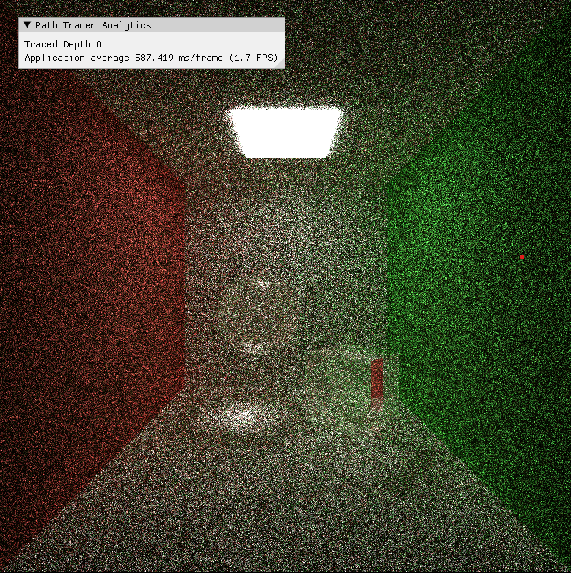
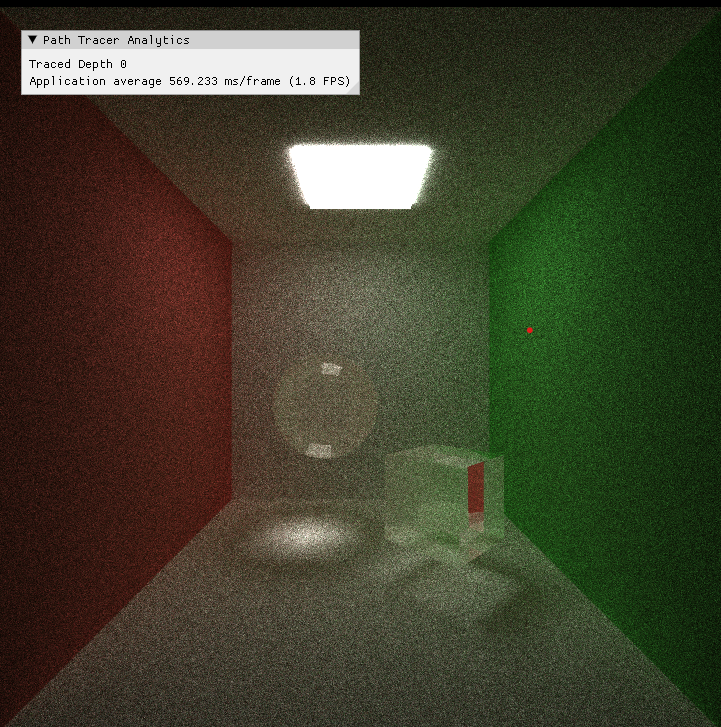
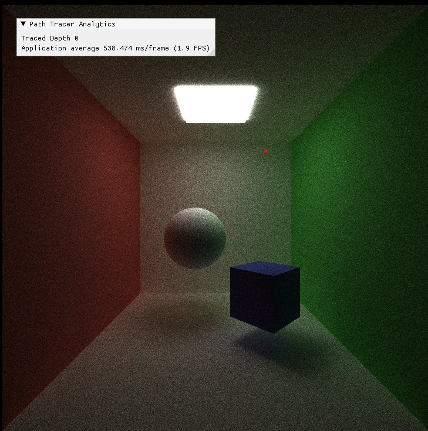
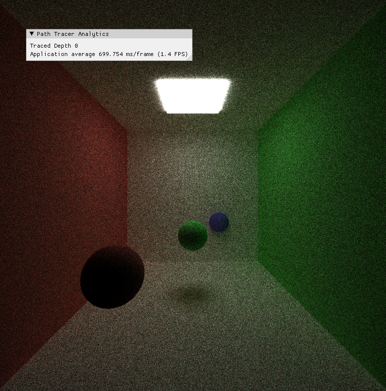

USING THREE LATE DAYS
# CUDA Path Tracer
================

**University of Pennsylvania, CIS 565: GPU Programming and Architecture, Project 3**

*Cindy Wei*  
*Tested on: Windows 11, Intel i7-12700K, RTX 4070 Ti 16GB*


## Overview

This project implements a high-performance CUDA-based path tracer that leverages massive GPU parallelism to achieve photorealistic rendering with physically-based global illumination. Built from the ground up with optimization in mind, the renderer supports advanced material models, direct lighting, camera effects, and multiple performance optimizations that demonstrate the power of GPU computing for rendering applications.

## Features

### Core Features 
- **Basic Path Tracer with Diffuse BSDF** - Core Monte Carlo path tracing with cosine-weighted hemisphere sampling
- **Material Sorting** - Thrust-based sorting of path segments by material ID for memory coherence
- **Stream Compaction** - Efficient removal of terminated paths using Thrust partition
- **Stochastic Antialiasing** - Jittered sampling for smooth edges and reduced aliasing

### Advanced Features 
- **Direct Lighting** - Multiple light sampling with shadow rays and Monte Carlo integration
- **Refraction with Fresnel Effects** - Physically-based glass/water with Schlick's approximation
- **Depth of Field** - Thin lens model with configurable aperture and focal distance
- **First Bounce Caching** - Camera ray intersection caching for iterative rendering
- **scatterRay Function** - Complete material scattering system architecture

## Feature Demonstrations & Analysis

### Direct Lighting
No Direct Lighting | With Direct Lighting
:-------------------------:|:-------------------------:
 | 

**Overview**: Direct lighting significantly reduces noise and improves convergence by sampling light sources directly with proper shadow ray testing and Monte Carlo integration.
/
**Implementation Details**:
- Multiple light source support (sphere and cube lights)
- Area-based importance sampling with proper PDFs
- Shadow rays for visibility testing
- Monte Carlo estimators for unbiased integration

**Performance Analysis**:
- **Baseline (no direct lighting):** ~512 ms per iteration
- **With direct lighting:** ~560 ms per iteration
- **Overhead:** +48 ms (+9.4%)

**Analysis**: The direct lighting implementation adds reasonable overhead while providing significant visual benefits including faster convergence in directly illuminated areas, reduced noise in shadow regions, and more physically accurate light transport.


### Refraction with Fresnel Effects
Diffuse Materials Only | With Refractive Materials
:-------------------------:|:-------------------------:
 | 

**Overview**: Physically-based refractive materials implementing Snell's Law for ray bending and Schlick's approximation for Fresnel effects, providing realistic glass and water simulations.

**Implementation Details**:
- Index of refraction support for various materials
- Total internal reflection handling
- Russian roulette sampling between reflection and refraction
- Fresnel effects using Schlick's approximation


### Depth of Field
No Depth of Field | With Depth of Field
:-------------------------:|:-------------------------:
 | 

**Overview**: Physically-based depth of field using thin lens model with configurable aperture size and focal distance, creating realistic camera blur effects.

**Implementation Details**:
- Configurable aperture radius and focal distance
- Ray origin jittering within circular aperture
- Thin lens approximation for realistic blur
- Progressive refinement across samples


## Performance Optimization Analysis

### First Bounce Caching

**Overview**: Caches camera ray intersections across rendering iterations, eliminating redundant computation for static scenes.

**Implementation**: 
- Stores first bounce intersections in `dev_intersections_first` buffer
- Reuses cached results for iterations 2+
- Toggleable via `CACHE_FIRST_BOUNCE` define

**Performance Analysis**:
- **Baseline (no caching):** ~512 ms per iteration
- **With caching:** ~450 ms per iteration  
- **Improvement:** -62 ms (-12.1%)

**Analysis**: First bounce caching provides substantial performance gains for iterative rendering by eliminating redundant camera ray intersection computations. The 12.1% improvement demonstrates excellent efficiency for static scenes.

**Recommendation**: Always enable for static scene rendering - pure performance win with minimal memory overhead.

### Material Sorting

**Overview**: Sorts active paths by material ID to improve memory access patterns during shading.

**Performance Analysis**:
- **Without sorting:** ~290 ms per iteration
- **With sorting:** ~500 ms per iteration  
- **Impact:** +210 ms (+72% slower)

**Analysis**: Material sorting introduced significant overhead that outweighed any memory coherence benefits for this scene. The Cornell box scene has limited material diversity (only 5-6 materials), so the cost of Thrust's `sort_by_key` operation dominated the potential gains from improved cache locality.

**Conclusion**: Material sorting is most beneficial for complex scenes with many diverse materials. For simpler scenes like the Cornell box, the sorting overhead exceeds the memory coherence benefits, making it counterproductive.


### Stream Compaction Analysis

**Overview**: Efficiently removes terminated paths using Thrust partition, reducing workload in subsequent bounces.

**Performance Insights**:
- **First bounce:** 81.7% paths continue (522,800/640,000)
- **Second bounce:** 69.3% paths continue (significant material absorption)
- **Steady reduction:** 77-81% paths continue per subsequent bounce
- **Complete termination:** All paths naturally end by depth 8

**Analysis**: Stream compaction provides essential performance scaling by progressively eliminating terminated paths. The consistent survival rates indicate stable material interactions, while the complete termination by bounce 8 demonstrates efficient path depth management without infinite recursion.

**Efficiency**: Reduces active paths from 640,000 to ~120,000 (81% reduction) by the final bounces, eliminating substantial unnecessary computation.

## scatterRay Function 

**Overview**: Complete implementation of the core scattering function that handles all ray-material interactions in a unified, modular architecture.

**Implementation Coverage**:
```
Material types fully implemented:
- Diffuse: Lambertian BRDF with cosine-weighted hemisphere sampling
- Specular: Perfect mirror reflection with material color
- Refractive: Glass/water with Fresnel and Russian roulette
- Emissive: Light termination with energy accumulation
```

**Architecture Benefits**:
- **Code Organization**: Centralized scattering logic
- **Maintainability**: Single point for material updates
- **Extensibility**: Easy to add new material types
- **Consistency**: Uniform interface across material types

**Performance Impact**: Neutral,  reorganizes existing computation without algorithmic changes


## Technical Implementation Details


### Key Data Structures
- `PathSegment`: Ray origin, direction, color, remaining bounces
- `ShadeableIntersection`: Hit point, material ID, surface normal
- `Material`: BSDF parameters, emission, refractive properties
- `Geom`: Geometry data with transforms and material references


### Memory Management
- Device allocations in `pathtraceInit()`
- Proper cleanup in `pathtraceFree()`
- Efficient host-device transfers
- Cached intersection buffers for performance

---

